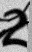

# Detecting CAPTCHA characters using TIMM Resnet

## Project Description
In this project we want to develop a deep learning model based on Convolutional Neural Networks (CNN) to solve CAPTCHAs, as they are often used to differentiate between humans and machines. This is a good measure of how well the model can adapt to a method, intended to make it fail. In addition to this we want to create a structure in this project that can be used as a template for further projects in machine learning. Not only will this make it easier to set up a new project, but it will also help in the future to understand the general structure and the meaning behind it in other peoples work.

We are using the *[PyTorch Image Models (timm)](https://github.com/rwightman/pytorch-image-models)* framework, which is a library containing for example different models applicable for image classification. We make use of the pretrained *resnet18* with a final layer to match the output size as the model of choice for our project. This model is not too complex but it should be enough for this project. Additionally we make use of pytorch lightning to train the model as it handles boilerplate code cleanly.

For our project we use the [*CAPTCHA Characters Dataset*](https://www.kaggle.com/datasets/tahabakhtari/captcha-characters-dataset-118k-images) published by Taha Bakhtari on kaggle. It covers over 118.000 black-and-white images of letters and digits from CAPTCHAs with an image size of 52x32 pixel. The dataset contains images of 20 different CAPTCHA characters being various digits and letters. This gives rise to an image classification problem with 20 classes.

Here’s an example of a CAPTCHA image from our dataset:



For now the data was loaded manually, using less than one gigabyte, but we will later implement the downloading process in the [data.py](src/captcha/data.py) and save the data using version control. We plan to start by randomly sampling 10.000 images at the start of development. We will then consider training on the entire dataset later on.


## Model
Here we talk about our model that we use.

## Frameworks and Tools (maybe)
Here we list the frameworks and tools that we use and maybe explain some important ones.

## Setup and installation (important)
Here we describe how to setup the project to reproduce our results.

## Progress (maybe)
Maybe a section to keep track of our progress.

## Future steps (maybe)
The next steps.

## Project structure
The directory structure of the project looks like this:
```txt
├── .github/                  # Github actions and dependabot
│   ├── dependabot.yaml
│   └── workflows/
│       └── tests.yaml
├── configs/                  # Configuration files
├── data/                     # Data directory
│   ├── processed
│   └── raw
├── dockerfiles/              # Dockerfiles
│   ├── api.Dockerfile
│   └── train.Dockerfile
├── docs/                     # Documentation
│   ├── mkdocs.yml
│   └── source/
│       └── index.md
├── models/                   # Trained models
├── notebooks/                # Jupyter notebooks
├── reports/                  # Reports
│   └── figures/
├── src/                      # Source code
│   ├── project_name/
│   │   ├── __init__.py
│   │   ├── api.py
│   │   ├── data.py
│   │   ├── evaluate.py
│   │   ├── models.py
│   │   ├── train.py
│   │   └── visualize.py
└── tests/                    # Tests
│   ├── __init__.py
│   ├── test_api.py
│   ├── test_data.py
│   └── test_model.py
├── .gitignore
├── .pre-commit-config.yaml
├── LICENSE
├── pyproject.toml            # Python project file
├── README.md                 # Project README
├── requirements.txt          # Project requirements
├── requirements_dev.txt      # Development requirements
└── tasks.py                  # Project tasks
```


Created using [mlops_template](https://github.com/SkafteNicki/mlops_template),
a [cookiecutter template](https://github.com/cookiecutter/cookiecutter) for getting
started with Machine Learning Operations (MLOps).
