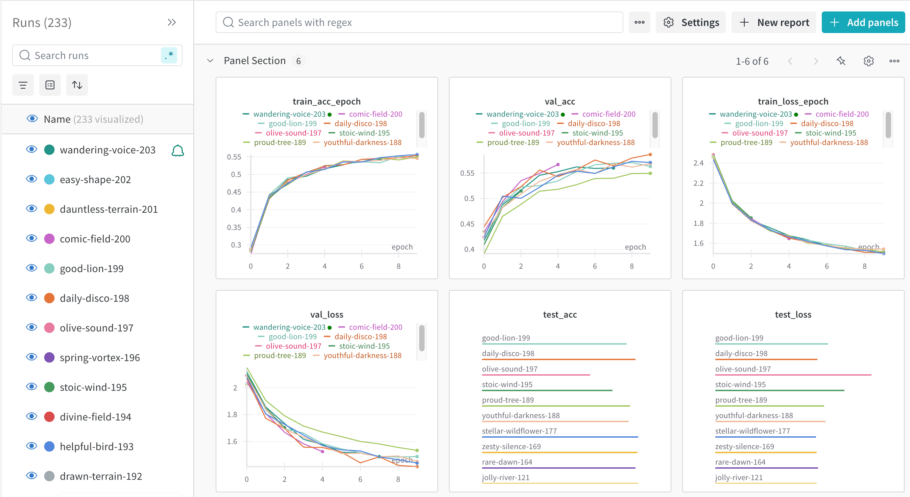
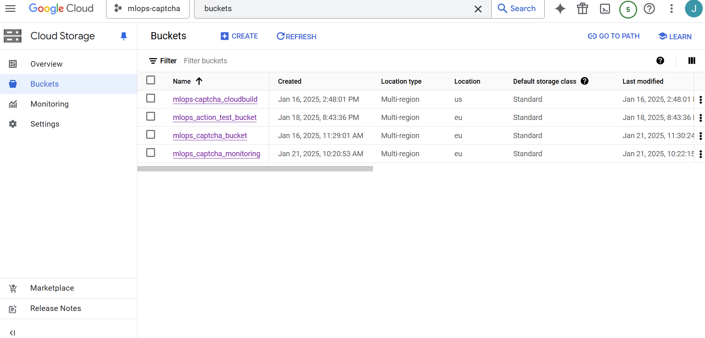
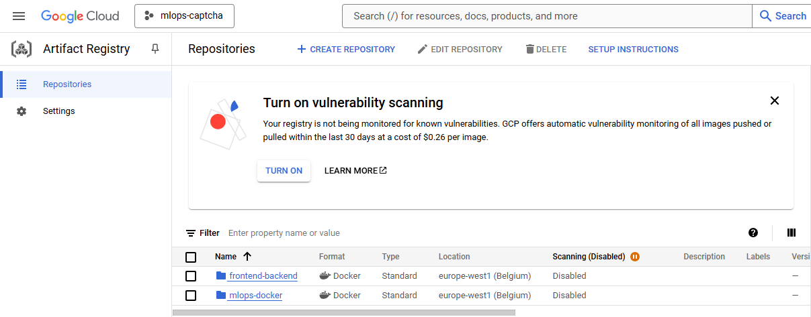
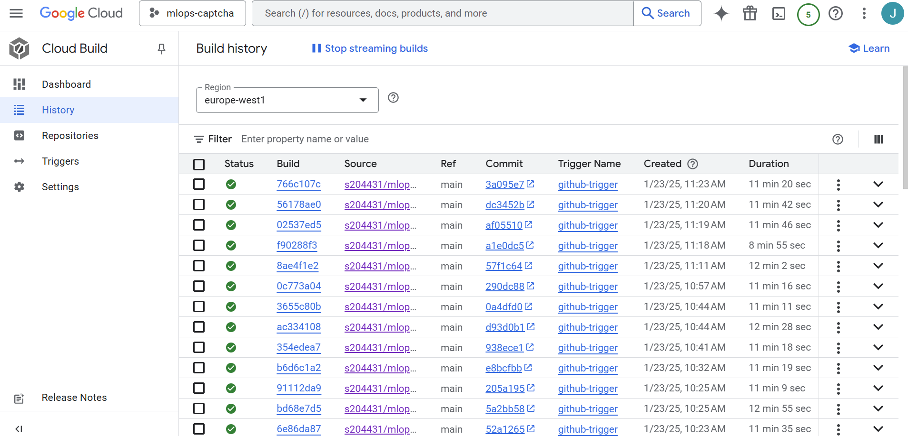

# Exam template for 02476 Machine Learning Operations

This is the report template for the exam. Please only remove the text formatted as with three dashes in front and behind
like:

```--- question 1 fill here ---```

Where you instead should add your answers. Any other changes may have unwanted consequences when your report is
auto-generated at the end of the course. For questions where you are asked to include images, start by adding the image
to the `figures` subfolder (please only use `.png`, `.jpg` or `.jpeg`) and then add the following code in your answer:

```markdown

```

In addition to this markdown file, we also provide the `report.py` script that provides two utility functions:

Running:

```bash
python report.py html
```

Will generate a `.html` page of your report. After the deadline for answering this template, we will auto-scrape
everything in this `reports` folder and then use this utility to generate a `.html` page that will be your serve
as your final hand-in.

Running

```bash
python report.py check
```

Will check your answers in this template against the constraints listed for each question e.g. is your answer too
short, too long, or have you included an image when asked. For both functions to work you mustn't rename anything.
The script has two dependencies that can be installed with

```bash
pip install typer markdown
```

## Overall project checklist

The checklist is *exhaustive* which means that it includes everything that you could do on the project included in the
curriculum in this course. Therefore, we do not expect at all that you have checked all boxes at the end of the project.
The parenthesis at the end indicates what module the bullet point is related to. Please be honest in your answers, we
will check the repositories and the code to verify your answers.

### Week 1

* [x] Create a git repository (M5)
* [x] Make sure that all team members have write access to the GitHub repository (M5)
* [x] Create a dedicated environment for you project to keep track of your packages (M2)
* [x] Create the initial file structure using cookiecutter with an appropriate template (M6)
* [x] Fill out the `data.py` file such that it downloads whatever data you need and preprocesses it (if necessary) (M6) - Petr
* [x] Add a model to `model.py` and a training procedure to `train.py` and get that running (M6)
* [x] Remember to fill out the `requirements.txt` and `requirements_dev.txt` file with whatever dependencies that you
    are using (M2+M6)
* [x] Remember to comply with good coding practices (`pep8`) while doing the project (M7)
* [x] Do a bit of code typing and remember to document essential parts of your code (M7)
* [x] Setup version control for your data or part of your data (M8)
* [x] Add command line interfaces and project commands to your code where it makes sense (M9)
* [x] Construct one or multiple docker files for your code (M10)
* [x] Build the docker files locally and make sure they work as intended (M10)
* [x] Write one or multiple configurations files for your experiments (M11)
* [x] Used Hydra to load the configurations and manage your hyperparameters (M11)
* [x] Use profiling to optimize your code (M12)
* [X] Use logging to log important events in your code (M14)
* [x] Use Weights & Biases to log training progress and other important metrics/artifacts in your code (M14) - Michael, Mads
* [x] Consider running a hyperparameter optimization sweep (M14)
* [x] Use PyTorch-lightning (if applicable) to reduce the amount of boilerplate in your code (M15)

### Week 2

* [x] Write unit tests related to the data part of your code (M16)
* [x] Write unit tests related to model construction and or model training (M16)
* [x] Calculate the code coverage (M16)
* [x] Get some continuous integration running on the GitHub repository (M17)
* [x] Add caching and multi-os/python/pytorch testing to your continuous integration (M17)
* [x] Add a linting step to your continuous integration (M17)
* [x] Add pre-commit hooks to your version control setup (M18)
* [X] Add a continues workflow that triggers when data changes (M19)
* [x] Add a continues workflow that triggers when changes to the model registry is made (M19)
* [x] Create a data storage in GCP Bucket for your data and link this with your data version control setup (M21)
* [x] Create a trigger workflow for automatically building your docker images (M21)
* [ ] Get your model training in GCP using either the Engine or Vertex AI (M21)
* [x] Create a FastAPI application that can do inference using your model (M22)
* [x] Deploy your model in GCP using either Functions or Run as the backend (M23)
* [x] Write API tests for your application and setup continues integration for these (M24)
* [x] Load test your application (M24)
* [x] Create a more specialized ML-deployment API using either ONNX or BentoML, or both (M25)
* [x] Create a frontend for your API (M26)

### Week 3

* [x] Check how robust your model is towards data drifting (M27)
* [x] Deploy to the cloud a drift detection API (M27)
* [x] Instrument your API with a couple of system metrics (M28)
* [x] Setup cloud monitoring of your instrumented application (M28)
* [x] Create one or more alert systems in GCP to alert you if your app is not behaving correctly (M28)
* [ ] If applicable, optimize the performance of your data loading using distributed data loading (M29)
* [ ] If applicable, optimize the performance of your training pipeline by using distributed training (M30)
* [ ] Play around with quantization, compilation and pruning for you trained models to increase inference speed (M31)

### Extra

* [ ] Write some documentation for your application (M32)
* [ ] Publish the documentation to GitHub Pages (M32)
* [ ] Revisit your initial project description. Did the project turn out as you wanted?
* [ ] Create an architectural diagram over your MLOps pipeline
* [ ] Make sure all group members have an understanding about all parts of the project
* [ ] Uploaded all your code to GitHub

## Group information

### Question 1
> **Enter the group number you signed up on <learn.inside.dtu.dk>**
>
> Answer:

Group 68

### Question 2
> **Enter the study number for each member in the group**
>
> Example:
>
> *sXXXXXX, sXXXXXX, sXXXXXX*
>
> Answer:

s204431, s195901, s243867, s240466, s240577

### Question 3
> **A requirement to the project is that you include a third-party package not covered in the course. What framework**
> **did you choose to work with and did it help you complete the project?**
>
> Recommended answer length: 100-200 words.
>
> Example:
> *We used the third-party framework ... in our project. We used functionality ... and functionality ... from the*
> *package to do ... and ... in our project*.
>
> Answer:

We used the third-party framework PyTorch Image Models (TIMM) in our project. From the framework we used a pre-trained image classification model. The pre-trained model, that was used in this project, was built using the architechture of ResNet18. The pre-trained model was afterwards fine-tuned for predicting Captcha images.
The reason for using a pre-trained model was mainly to utilize the pre-trained weights to improve the training speed. Additionally, using the ResNet architechture, we make sure that training is stable and that we don't have to nudge as many hyperparameters to still get the model to work well. A bonus is that the TIMM framework was really easy to use and that we avoid problems like vanishing gradients without having to actively take it into consideration.

## Coding environment

> In the following section we are interested in learning more about you local development environment. This includes
> how you managed dependencies, the structure of your code and how you managed code quality.

### Question 4

> **Explain how you managed dependencies in your project? Explain the process a new team member would have to go**
> **through to get an exact copy of your environment.**
>
> Recommended answer length: 100-200 words
>
> Example:
> *We used ... for managing our dependencies. The list of dependencies was auto-generated using ... . To get a*
> *complete copy of our development environment, one would have to run the following commands*
>
> Answer:

In order to manage dependencies in our project we used requirement files. We have four different requirement files: requirements.txt, requirements_dev.txt, requirements_backend.txt and requirements_frontend.txt. The requirements.txt files is the most important since it contains the essential requirements for running the code. The requirements_dev.txt file contains additional dependencies that are not necessary for running the code, but may be useful for a developer of the project. The remaining two are dependencies for the backend and frontend respectively and are simply subsets of the requirements.txt file such that the docker images do not contain unnecessary dependencies.
A new member of the team would need to execute the following commands to get a copy of the environment:\
git clone https://github.com/s204431/mlops-CAPTCHA \
pip install -e .\
dvc pull\
pre-commit install

Note that this assumes that the team member has already installed python version 3.11 or greater and pip.

### Question 5

> **We expect that you initialized your project using the cookiecutter template. Explain the overall structure of your**
> **code. What did you fill out? Did you deviate from the template in some way?**
>
> Recommended answer length: 100-200 words
>
> Example:
> *From the cookiecutter template we have filled out the ... , ... and ... folder. We have removed the ... folder*
> *because we did not use any ... in our project. We have added an ... folder that contains ... for running our*
> *experiments.*
>
> Answer:

We used the original cookie cutter template suggested in the exercises for the course. The only folder that we have not used from that template is the notebooks folder. Otherwise every folder that was in the original template was used.
Additional folders have been added with time when it seemed fitting. This mostly includes folders for experiment logging: WANDB logging was saved in the wandb/ folder, torch lightning logging was saved in both the lightning_logs/ folder and the outputs/ folder and hydra logging was saved in the outputs/ folder.
Otherwise, the overall structure of the project stayed true to that of the original template, which means that we mostly added to the existing folders where it seemed the most fitting.

### Question 6

> **Did you implement any rules for code quality and format? What about typing and documentation? Additionally,**
> **explain with your own words why these concepts matters in larger projects.**
>
> Recommended answer length: 100-200 words.
>
> Example:
> *We used ... for linting and ... for formatting. We also used ... for typing and ... for documentation. These*
> *concepts are important in larger projects because ... . For example, typing ...*
>
> Answer:

We used ruff for both linting and formatting following the pep8 convention. We have set this up such that it works automatically using pre-commit to run ruff checks each time a team member uses git commit. We have also set up automatic code checking using Github actions, such that Github actions runs ruff checking each time we push to the repository and fixes potential issues. For typing we have used typing on the inputs and outputs of functions. For documentation we have added a comment to each function explaining what it does and some comments internally in functions.
These concepts are important since it makes it much easier for someone who has not worked on the code to understand the code since it follows common conventions. Documentation and typing also makes it easier for developers of the code to still understand it when they haven't worked on it in a while. This is especially useful in larger projects, where there is a large amount of code to understand and a large number of people.

## Version control

> In the following section we are interested in how version control was used in your project during development to
> corporate and increase the quality of your code.

### Question 7

> **How many tests did you implement and what are they testing in your code?**
>
> Recommended answer length: 50-100 words.
>
> Example:
> *In total we have implemented X tests. Primarily we are testing ... and ... as these the most critical parts of our*
> *application but also ... .*
>
> Answer:

We implemented tests for most of the code. In total we have 14 tests for the model, data, training and APIs which we find to be the most important parts of the code. The API tests include tests for the backend and frontend which ensure that the APIs are running and returning the expected data. We also have locust files for load testing.

### Question 8

> **What is the total code coverage (in percentage) of your code? If your code had a code coverage of 100% (or close**
> **to), would you still trust it to be error free? Explain you reasoning.**
>
> Recommended answer length: 100-200 words.
>
> Example:
> *The total code coverage of code is X%, which includes all our source code. We are far from 100% coverage of our **
> *code and even if we were then...*
>
> Answer:

The total code coverage of our code is 58%. As code coverage only explains the percentage of the code that has been executed during the tests, we cannot trust the code to be completely error free. The reason for this being the case, is that code coverage cannot ensure that the entire functionality of the program is covered. Even though all of the code is covered by the tests, there might be some program flow that hasn't been covered or even some edge cases that should have been tested. Additionally, the output of some of the methods could be wrong even though 100% of the code is covered.

### Question 9

> **Did you workflow include using branches and pull requests? If yes, explain how. If not, explain how branches and**
> **pull request can help improve version control.**
>
> Recommended answer length: 100-200 words.
>
> Example:
> *We made use of both branches and PRs in our project. In our group, each member had an branch that they worked on in*
> *addition to the main branch. To merge code we ...*
>
> Answer:

We made use of branches for some parts of our projects. This was in particular when working on a new feature for the project. When the feature was finished we would merge the branch into the main branch. However, we could have been more disciplined with remembering to always use branches for new features. We did not really use pull requests. The main reason for this is because the project is quite small and we are working in a relatively small team and trust all team members. For larger projects it may be more beneficial to use these features more as they ensure that the main branch is kept clean. Pull requests can also ensure that non-working code is not pushed onto the main branch and can allow untrusted users to contribute.

### Question 10

> **Did you use DVC for managing data in your project? If yes, then how did it improve your project to have version**
> **control of your data. If no, explain a case where it would be beneficial to have version control of your data.**
>
> Recommended answer length: 100-200 words.
>
> Example:
> *We did make use of DVC in the following way: ... . In the end it helped us in ... for controlling ... part of our*
> *pipeline*
>
> Answer:

Yes we made use of DVC for version control of our data. We have stored both the raw data and the processed data in the cloud. We have then used DVC for pulling data from the cloud and pushing new data in case the data gets updated. It would also make it easy to get the data in case a new member joins the team. However, it has not been used much during the project because the data that we have used would typically not be changed. We have used a dataset from Kaggle and thus the data would not change during the project. In a bigger project it may be more beneficial, especially if new data is being collected frequently.

### Question 11

> **Discuss you continuous integration setup. What kind of continuous integration are you running (unittesting,**
> **linting, etc.)? Do you test multiple operating systems, Python  version etc. Do you make use of caching? Feel free**
> **to insert a link to one of your GitHub actions workflow.**
>
> Recommended answer length: 200-300 words.
>
> Example:
> *We have organized our continuous integration into 3 separate files: one for doing ..., one for running ... testing*
> *and one for running ... . In particular for our ..., we used ... .An example of a triggered workflow can be seen*
> *here: <weblink>*
>
> Answer:

We have implemented all of the the project checkmarks related to continuous integration. Unit tests related to data, dataset, model construction and/or model training can be found in the tests/unittests folder. Tests for the raw data images can be found in the tests/test_images folder. The tests folder also contains locust performance tests and integration tests for the api, but more on those in the later questions.
All of the mentioned tests can be run using the `pytest tests/` command. The coverage of the tests can be found using the `coverage run -m pytest tests/` and `coverage report` commands. This will give a coverage report showing the coverage of each test and a summary of the coverage of all tests.
Continuous workflow files can be found in the .github/workflows folder. This folder contains workflow files for tests, pre-commit hooks, code checking, model staging and data changes. Additionally, docker images are automatically built using workflows. All of the triggered workflows can be monitored using the following link: <https://github.com/s204431/mlops-CAPTCHA/actions>. At times during the project, some of these workflows were disabled to make sure that the free GitHub test limit is not exceeded as we have been performing a lot of commits to the main branch.

## Running code and tracking experiments

> In the following section we are interested in learning more about the experimental setup for running your code and
> especially the reproducibility of your experiments.

### Question 12

> **How did you configure experiments? Did you make use of config files? Explain with coding examples of how you would**
> **run a experiment.**
>
> Recommended answer length: 50-100 words.
>
> Example:
> *We used a simple argparser, that worked in the following way: Python  my_script.py --lr 1e-3 --batch_size 25*
>
> Answer:

We have used Hydra for managing config files and running experiments. This would make it quite easy to run experiments. The code is simply run normally and a new folder with information about the experiment would be stored. The config files can be changed in order to change the parameters. We have config files for training parameters and optimizer parameters.

### Question 13

> **Reproducibility of experiments are important. Related to the last question, how did you secure that no information**
> **is lost when running experiments and that your experiments are reproducible?**
>
> Recommended answer length: 100-200 words.
>
> Example:
> *We made use of config files. Whenever an experiment is run the following happens: ... . To reproduce an experiment*
> *one would have to do ...*
>
> Answer:

We made use of config files. All config files related to experiments can be found in the configs folder. As stated in the previous answer, Hydra was used for logging of hyperparameters. Whenever an experiment is run, Hydra saves the configuration used for that run in the outputs folder ensuring that all parameters necessary for reproducing the experiment is saved. The allows us to reproduce any experiment by changing the existing config files according to the previously saved files. Additionally, all config files are version controlled by git ensuring that changes can be reverted to match a specific experiment previously run.

### Question 14

> **Upload 1 to 3 screenshots that show the experiments that you have done in W&B (or another experiment tracking**
> **service of your choice). This may include loss graphs, logged images, hyperparameter sweeps etc. You can take**
> **inspiration from [this figure](figures/wandb.png). Explain what metrics you are tracking and why they are**
> **important.**
>
> Recommended answer length: 200-300 words + 1 to 3 screenshots.
>
> Example:
> *As seen in the first image when have tracked ... and ... which both inform us about ... in our experiments.*
> *As seen in the second image we are also tracking ... and ...*
>
> Answer:

As seen in the  we have tracked the train accuracy and loss, validation accuracy and loss, test accuracy and loss, and the number of epochs which inform us about how well our model is preforming and if there are some issues like overfitting/underfitting in our experiments. The used loss is the train, validation and test are the cross-entropy loss. This loss is used since we have multiple classes to predict. We want to track the loss since we can keep an eye on the performance. Furthermore, we used accuracy to see how many the model predicts correctly. These metrics can also be used to investigate model performance. The first two plots show the accuracy for training and validation. We can see that it nicely converges after rising fast in the beginning which indicates that our model is training in an expected way. We seem to get an average accuracy of around 55% after ten epochs which is acceptable for this task but could be improved upon. The next two graphs show the loss for train and test and here we can also see how it nicely converges to around 1.5, also in an expected way. Those plots already tell us that the models seem to behave normally. Lastly, we have the test accuracy and loss of the past ten experiments. Here we then see how the model has performed in the past experiments and can compare the current experiment to the past ones. This can be used to see if the model is improving or not.

### Question 15

> **Docker is an important tool for creating containerized applications. Explain how you used docker in your**
> **experiments/project? Include how you would run your docker images and include a link to one of your docker files.**
>
> Recommended answer length: 100-200 words.
>
> Example:
> *For our project we developed several images: one for training, inference and deployment. For example to run the*
> *training docker image: `docker run trainer:latest lr=1e-3 batch_size=64`. Link to docker file: <weblink>*
>
> Answer:

For our project we developed several images: one for training, one for evaluating the model, one for the deployment backend and frontend.
And example of how to run one of our docker files can be seen below:
The following is a link to the evaluate docker file: <https://github.com/s204431/mlops-CAPTCHA/blob/main/dockerfiles/evaluate.dockerfile>
You can build this dockerfile by running the following command from the root of the project: `docker build -f dockerfiles/evaluate.dockerfile . -t eval:latest?
You can run the docker image created by the previous command by running the following command: `docker run --name eval1 eval:latest`
To run this dockerfiles successfully you need to have a trained model in the models folder: models/model.pth.

### Question 16

> **When running into bugs while trying to run your experiments, how did you perform debugging? Additionally, did you**
> **try to profile your code or do you think it is already perfect?**
>
> Recommended answer length: 100-200 words.
>
> Example:
> *Debugging method was dependent on group member. Some just used ... and others used ... . We did a single profiling*
> *run of our main code at some point that showed ...*
>
> Answer:

Each group member had their own way of debugging the code. Some used the built-in debugger in Visual Studio Code and some just used print statements and logs. This worked fine and we did not have bugs that took too long to solve. We have set up some profiling for the evaluation of the model in order to check if there was a bottle-neck in the model. This did not show any significant bottle-neck. We have also made use of pytorch-lightning and the Timm framework, which means that there were many parts of the code that we did not make ourselves and therefore we cannot change these parts despite what the profiling shows. Overall, we think that are code works well without any major bottle-necks.

## Working in the cloud

> In the following section we would like to know more about your experience when developing in the cloud.

### Question 17

> **List all the GCP services that you made use of in your project and shortly explain what each service does?**
>
> Recommended answer length: 50-200 words.
>
> Example:
> *We used the following two services: Engine and Bucket. Engine is used for... and Bucket is used for...*
>
> Answer:

Compute Engine - For creating and running VMs
Cloud Storage - For storing our data
Artifact Registry - For storing model artifacts
Cloud Build - For automatically building docker images
Vertex AI - For training our model in the cloud
Secret Manager - For storing a WANDB API key used in relation to the training
Cloud Logging - For debugging cloud related bugs


### Question 18

> **The backbone of GCP is the Compute engine. Explained how you made use of this service and what type of VMs**
> **you used?**
>
> Recommended answer length: 100-200 words.
>
> Example:
> *We used the compute engine to run our ... . We used instances with the following hardware: ... and we started the*
> *using a custom container: ...*
>
> Answer:

We have used the GCP Compute Engine API to create virtual machines and train our model using those virtual machines. We have tried multiple ways of training our model on the virtual machines, one of which was just cloning the repository, installing the required dependencies on the VM and lastly running src/training.py. We have also tried running the automatically built docker image, but as there were problems getting both of the methods to work. At first, we decided to just focus on cloning, installing and running the project but after getting that to work, we had time to focus on getting Vertex AI to train using our docker images as well.
For the virtual machine that we used to train our model, we used an instance with the following hardware: n1-standard-4 (machine type), Intel Haswell (CPU platform), europe-west1-b (Zone)


### Question 19

> **Insert 1-2 images of your GCP bucket, such that we can see what data you have stored in it.**
> **You can take inspiration from [this figure](figures/bucket.png).**
>
> Answer:



### Question 20

> **Upload 1-2 images of your GCP artifact registry, such that we can see the different docker images that you have**
> **stored. You can take inspiration from [this figure](figures/registry.png).**
>
> Answer:



### Question 21

> **Upload 1-2 images of your GCP cloud build history, so we can see the history of the images that have been build in**
> **your project. You can take inspiration from [this figure](figures/build.png).**
>
> Answer:



### Question 22

> **Did you manage to train your model in the cloud using either the Engine or Vertex AI? If yes, explain how you did**
> **it. If not, describe why.**
>
> Recommended answer length: 100-200 words.
>
> Example:
> *We managed to train our model in the cloud using the Engine. We did this by ... . The reason we choose the Engine*
> *was because ...*
>
> Answer:

--- question 22 fill here ---

## Deployment

### Question 23

> **Did you manage to write an API for your model? If yes, explain how you did it and if you did anything special. If**
> **not, explain how you would do it.**
>
> Recommended answer length: 100-200 words.
>
> Example:
> *We did manage to write an API for our model. We used FastAPI to do this. We did this by ... . We also added ...*
> *to the API to make it more ...*
>
> Answer:

Yes we managed to write an API for the model. We have made both a backend and frontend for inference of the model. The backend is the main API used for making predictions. For this, we make use of onnx and bentoml. The onnx library is used to convert the model into a simpler version designed for inference such that we do not need to include the Pytorch library in the docker image for the backend. The bentoml library is used to create the API itself. We have created a service with 2 workers such that it can handle requests concurrently. It has a single /predict endpoint. In order to use the endpoint an image must be sent in a POST request and it must have the correct format. That is, it must be a 32*52 image with a single channel. The returned data is a list of probabilities for each of the 20 possible classes.

### Question 24

> **Did you manage to deploy your API, either in locally or cloud? If not, describe why. If yes, describe how and**
> **preferably how you invoke your deployed service?**
>
> Recommended answer length: 100-200 words.
>
> Example:
> *For deployment we wrapped our model into application using ... . We first tried locally serving the model, which*
> *worked. Afterwards we deployed it in the cloud, using ... . To invoke the service an user would call*
> *`curl -X POST -F "file=@file.json"<weburl>`*
>
> Answer:

Yes we have managed to deploy the API in the cloud. It was deployed by first containerizing the bentoml service using docker. Then, the docker image was pushed to artifact registry for the project in Google Cloud. Finally, the service was deployed using cloud run. The service works by receiving an image in a POST request. The link to the service is: https://backend-1048604560911.europe-west1.run.app \
The service has a single endpoint at /predict, where images can be sent. We recommend not sending these requests directly using curl. Using the front end is highly recommended as this allows uploading images and automatically converting to the correct format. More on this later. The returned data will be a list of probabilities for each of the 20 possible classes. Again, we recommend using the front end for visualizing the prediction.

### Question 25

> **Did you perform any unit testing and load testing of your API? If yes, explain how you did it and what results for**
> **the load testing did you get. If not, explain how you would do it.**
>
> Recommended answer length: 100-200 words.
>
> Example:
> *For unit testing we used ... and for load testing we used ... . The results of the load testing showed that ...*
> *before the service crashed.*
>
> Answer:

We implemented testing of the API and load testing. The API testing works by sending request to both the frontend and the backend. The frontend test simply sents a get request and ensures that a 200 status code is returned. This ensures that the frontend is running. The backend test is a bit more complicated. Here, we have some example images that are each sent to the backend using POST request. The test then checks that it receives an answer, and that the answer is of the correct format. That is, a list containing probabilities for 20 classes. This ensures that the backend is running and returning data on the correct format.\
We have also implemented load testing. This was done using locust. We have two different locust files, one for the frontend and one for the backend. The frontend load test simply sends get requests to the frontend, ensuring that multiple users can access it. The backend load test sends random images from the example images to the backend. We performed load tests using 10 users at a time. This worked with no failures and gave a response time of no more than 100 ms in all cases.

### Question 26

> **Did you manage to implement monitoring of your deployed model? If yes, explain how it works. If not, explain how**
> **monitoring would help the longevity of your application.**
>
> Recommended answer length: 100-200 words.
>
> Example:
> *We did not manage to implement monitoring. We would like to have monitoring implemented such that over time we could*
> *measure ... and ... that would inform us about this ... behaviour of our application.*
>
> Answer:

Yes, we implemented monitoring of the deployed model in the cloud. In particular, we implemented monitoring for the backend service. We also deployed a drift detection API as a new service called "monitoring". The backend service has a /metrics endpoint which outputs different metrics, such as number of request, latency of requests, number of errors, etc. This allows us to keep track of the different metrics and make sure that they are as expected. We have used a sidecar container to read these metrics and display them in the monitor tab for Cloud Run. In addition to this, we have set up an alerting system. We have configured it to give an alert with a warning when the number of requests per minute is high.

## Overall discussion of project

> In the following section we would like you to think about the general structure of your project.

### Question 27

> **How many credits did you end up using during the project and what service was most expensive? In general what do**
> **you think about working in the cloud?**
>
> Recommended answer length: 100-200 words.
>
> Example:
> *Group member 1 used ..., Group member 2 used ..., in total ... credits was spend during development. The service*
> *costing the most was ... due to ... . Working in the cloud was ...*
>
> Answer:

--- question 27 fill here ---

### Question 28

> **Did you implement anything extra in your project that is not covered by other questions? Maybe you implemented**
> **a frontend for your API, use extra version control features, a drift detection service, a kubernetes cluster etc.**
> **If yes, explain what you did and why.**
>
> Recommended answer length: 0-200 words.
>
> Example:
> *We implemented a frontend for our API. We did this because we wanted to show the user ... . The frontend was*
> *implemented using ...*
>
> Answer:

In addition to what was previously mentioned, we also implemented a frontend and data drifting. The frontend uses streamlit. It allows the user to upload any image and it will then convert this image to the correct format and send a request to the backend API. After receiving a prediction, it presents this visually to the user by showing the prediction and probabilities. The frontend can be accessed here: https://frontend-1048604560911.europe-west1.run.app \
The data drifting API was added as a new service at https://monitoring-1048604560911.europe-west1.run.app/report. This was done using evidently. It gathers the training data and logs from inference in our bucket in the cloud.

### Question 29

> **Include a figure that describes the overall architecture of your system and what services that you make use of.**
> **You can take inspiration from [this figure](figures/overview.png). Additionally, in your own words, explain the**
> **overall steps in figure.**
>
> Recommended answer length: 200-400 words
>
> Example:
>
> *The starting point of the diagram is our local setup, where we integrated ... and ... and ... into our code.*
> *Whenever we commit code and push to GitHub, it auto triggers ... and ... . From there the diagram shows ...*
>
> Answer:

--- question 29 fill here ---

### Question 30

> **Discuss the overall struggles of the project. Where did you spend most time and what did you do to overcome these**
> **challenges?**
>
> Recommended answer length: 200-400 words.
>
> Example:
> *The biggest challenges in the project was using ... tool to do ... . The reason for this was ...*
>
> Answer:

Most of the struggles came from working in the cloud, mainly because debugging took A LOT of time. The two implementation that caused the most issues and cost the most time was building docker images automatically in the cloud and using Vertex AI and/or Compute Engine to train our model in the cloud. The main struggle with both of them was the waiting time inbetween knowing whether the bugs, that we tried to fix, were actually fixed. The waiting time could easily amount to 20-30 minutes before we got the error logs. Overall, bugs related to running or building the bloud greatly inhibited the debugging process, especially when trying to get the training to work both by using Vertex AI to train using our docker image and by cloning the repository, installing it and running the train.py.
Otherwise some time was spent on making multiple different implementations run at the same time that otherwise would run independently of each other. An example of this is making the docker images run with WANDB keys on multiple different platforms, especially making it work in the cloud.
Apart from those challenges, most of the development went smoothly. When encountering problems, we solved them in a reasonable time.

### Question 31

> **State the individual contributions of each team member. This is required information from DTU, because we need to**
> **make sure all members contributed actively to the project. Additionally, state if/how you have used generative AI**
> **tools in your project.**
>
> Recommended answer length: 50-300 words.
>
> Example:
> *Student sXXXXXX was in charge of developing of setting up the initial cookie cutter project and developing of the*
> *docker containers for training our applications.*
> *Student sXXXXXX was in charge of training our models in the cloud and deploying them afterwards.*
> *All members contributed to code by...*
> *We have used ChatGPT to help debug our code. Additionally, we used GitHub Copilot to help write some of our code.*
> Answer:

--- question 31 fill here ---
